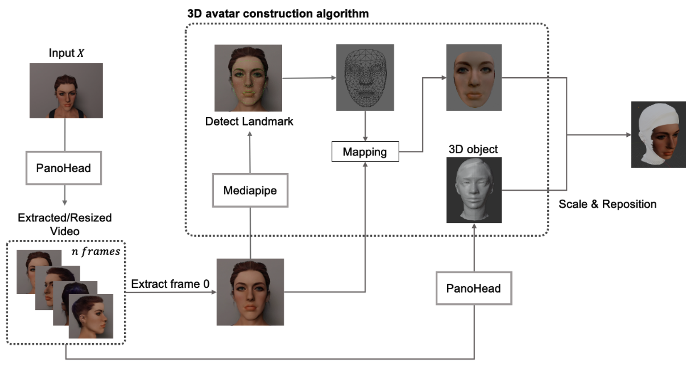

# 3D_face_Reconstruction
 Development of Face Characteristics Analysis and Avatar Generation Technology by NVidia Jetson  
_NVidia Jetson을 이용한 얼굴특성분석 및 아바타 제작 기술 개발_
***

<h2>최종 결과</h2>
- Generative AI 모델을 이용한 3D 머리 모델 합성 알고리즘 개발  
  - Generative AI 모델 기반 3D 머리 모델 합성 SW  
- Face Landmark 예측을 이용한 기존 3D 모델과의 매칭 기술 개발  
  - Face Landmark 예측 기반 3D 모델 매칭 SW  

<h2>workflow</h2>

 

<h2>Overview</h2> 
본 연구의 목표는 단일 2차원 이미지를 사용하여 3차원 아바타 모델을 생성하는 것이다.
1) 원본 이미지를 PanoHead를 통해 얼굴을 포함한 머리 전체를 나타낼 수 있는 영상으로 데 이터 증강을 진행한다. (512*512(px)*60fps * 4s)
2) 위 과정에서 생성된 영상의 첫 프레임 (이는, 얼굴 정면 이미지에 해당)를 추출하여 MediaPipe라이브러리를 통해 얼굴의 특징점을 추출하고, 이를 3차원으로 재구성한다. 이 때, 첫 프레임의 이미지는 재구성된 3차원 아바타 모델의 Texture가 된다.
3) 동시에 PanoHead를 사용해 영상 데이터를 3D object 파일로 전환하고, 두 파일을 재배치해 최종 3D 모델을 구성한다.

<h2>2D 얼굴사진을 이용한 3D 모델 합성 예시</h2>
 

**실험결과**
- 실험 결과 MediaPipe와 PanoHead로 생성한 object 파일의 전체 얼굴에 대한 형태와 구조 를 비슷하게 형성함을 확인함.
- 각 object 파일을 Blender 상에서 스크립트를 통해 3D Avatar과 같이 배치됨을 확인함.
- 3차원 아바타 모델과 3차원 아바타 텍스처 파일이 서로 다른 모델에서 생성되기에 완벽한 mapping이 이루어지지 않음.
